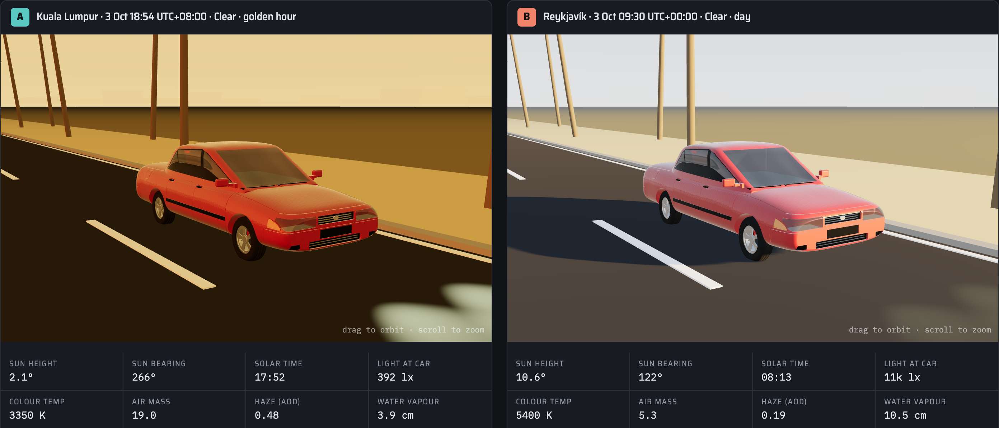
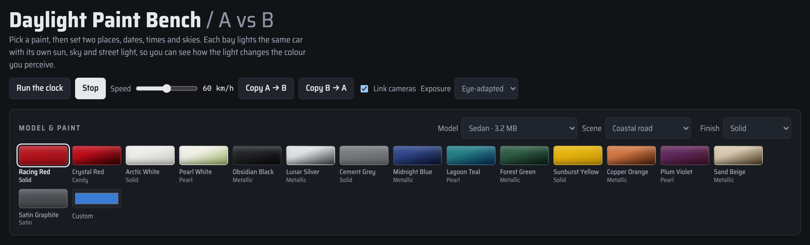
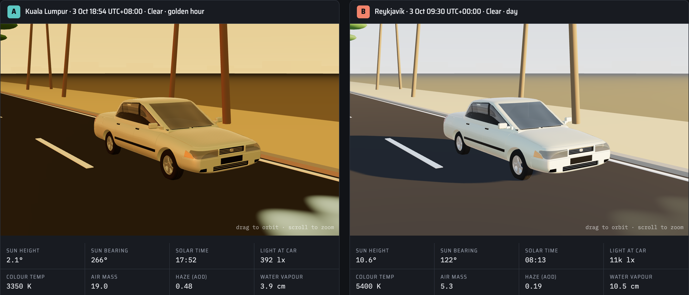
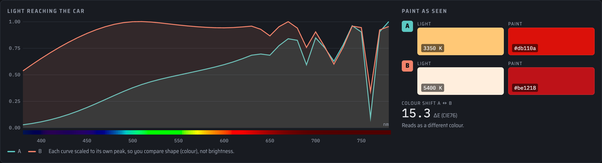
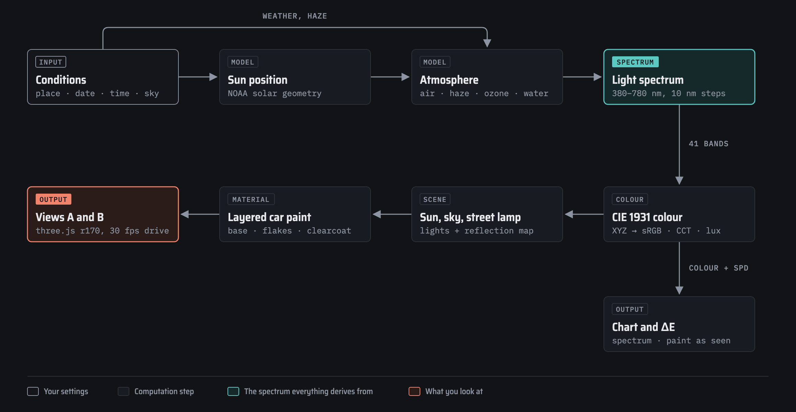

# Automotive Paint Bench

Check how a car colour reads under real daylight before you paint a sample panel. Pick a paint, set two places, dates, times and skies, and the bench lights the same car twice so you can compare them side by side.



## Why it exists

A paint chip approved in a light booth shifts once the car leaves it. A low evening sun crosses 19 times more air than a noon sun, scatters out the blue, and turns white paint gold. Haze, humidity, ozone, cloud and sodium street lamps each reshape the light again. You can't hold a chip up in Kuala Lumpur at dusk and Reykjavík in the morning on the same afternoon.

The bench computes the light spectrum for each condition, renders your car model in it, and reports how far apart the two results look (ΔE). Designers and colour engineers can use it to shortlist colours, explain a customer complaint about "the wrong red", or pick photo-shoot times.

## What you see

### 1. Controls



- **Run the clock** sweeps both bays through the day. **Drive** scrolls the road past the car at the speed you set (0 to 120 km/h); in the studio it spins the car on a turntable.
- **Model** loads one of seven car models. **Scene** switches between city road, highway, coastal road and studio.
- **Paint chips** carry a finish type: solid, metallic, pearl, candy or satin. The custom picker takes any colour, and **Finish** changes the paint type.
- Each bay has its own region, timezone, date, clock time, sky, air temperature, humidity, aerosol, altitude, ozone, car heading, street light and headlights.

### 2. A/B comparison

Both shots use the same sedan, scene and camera. Bay A sits in Kuala Lumpur at 18:54 with the sun 2.1° above the horizon and 3350 K light. Bay B sits in Reykjavík at 09:30 with the sun at 10.6° and 5400 K light.

| Racing Red (solid) | Pearl White (tri-coat pearl) |
| --- | --- |
|  |  |
| ΔE 15.3: a visible shift in shade | ΔE 37.1: reads as a different colour |

White paint has no hue of its own, so it takes on the colour of the light and shows the biggest shift. The stats row under each view gives sun height and bearing, solar time, illuminance at the car, colour temperature, air mass, effective haze and water vapour.

### 3. Light spectrum profile



The chart plots the light reaching the car from 380 to 780 nm. Each curve is scaled to its own peak, so you compare shape, which decides colour, and not brightness. The evening curve (A) climbs toward red because the long air path removed the blue. The dips near 690, 720 and 760 nm come from water vapour and oxygen. The swatches on the right show the light colour and the paint as your eye would see it, and the ΔE score rates the gap: under 2 you won't notice it, over 15 the two read as different colours.

## How it works



1. Your settings fix the sun's position (NOAA solar geometry) and the state of the air.
2. A single-scattering atmosphere model filters sunlight through Rayleigh scattering, Ångström aerosol, Chappuis ozone and water vapour and oxygen bands, in 41 bands from 380 to 780 nm. Clouds diffuse it; twilight and street lamps add their own spectra.
3. CIE 1931 colour matching turns each spectrum into the sun colour, sky colour, colour temperature and illuminance.
4. three.js (r170) lights the scene with those colours. The car paint stacks a base coat whose colour shifts with viewing angle, metallic or mica flakes that glint around the sun highlight, and a clearcoat with orange-peel texture. Pearl adds thin-film iridescence; candy darkens toward the edges.
5. Eye-adapted exposure keeps a dusk scene readable the way your eyes adjust. Switch to **Fixed (noon)** exposure to see true brightness.

## Run it

```bash
python3 -m http.server 8080
```

Open http://127.0.0.1:8080. Browsers block model loads from `file://`, so you need the local server. The page pulls three.js from jsdelivr and fonts from Google Fonts, so it needs a network connection.

## Models

`models/*.glb` use metres, Y up and length along X. The page centres each model, turns its front toward the camera and paints the largest opaque non-trim material as the body.

| Model | Source | Wheels spin when driving |
| --- | --- | --- |
| Myvi, Myvi v2 | awantech `GLB/` | yes |
| Compact hatchback | awantech `compact-hatchback/GLB/` | yes |
| Sedan, Cybertruck | exported from STEP in `automotive-cad-model-preview/models/STEP/` with `cadgen glb build` | yes |
| Angular pickup | awantech `text-to-cad.ready/models/angular_pickup/GLB/` | yes |
| Smart fortwo | awantech `text-to-cad.ready/models/smart_fortwo/GLB/` | no, its wheels are fused into the body mesh |
| Concept | built into the page | yes |

## Limits

- The atmosphere model is built for side-by-side comparison. Don't use it for calibrated colour grading or sign-off.
- Clock times are standard time; the bench ignores daylight saving.
- Flake sparkle follows the sun only, so it fades under overcast skies.
- Scenes use flat-coloured low-poly props to keep memory low with two views open.
- At driving speed the wheels can appear to turn backwards, the same strobing a film camera shows.
